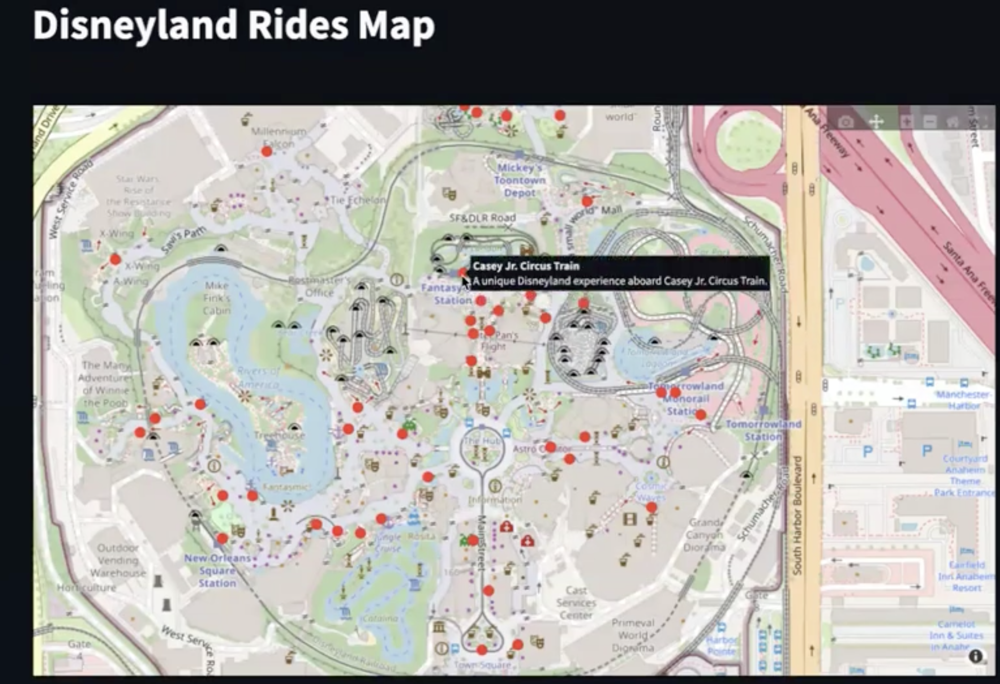
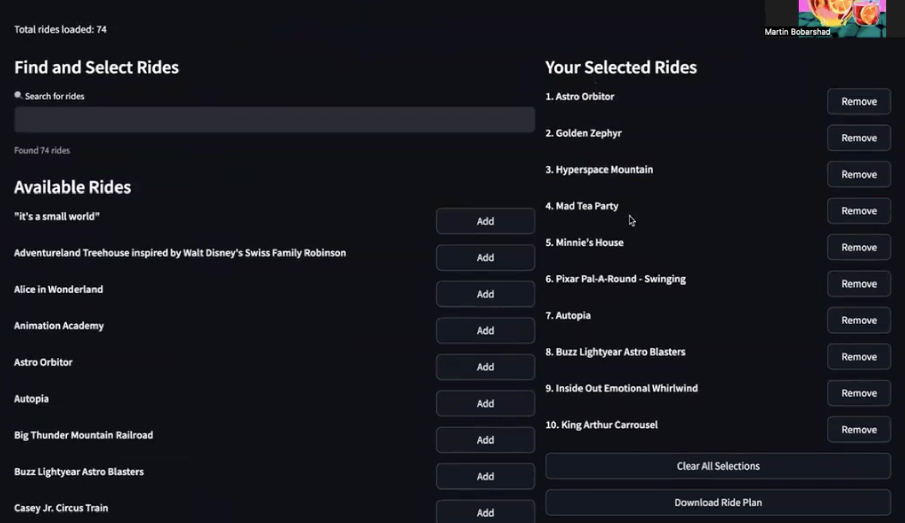
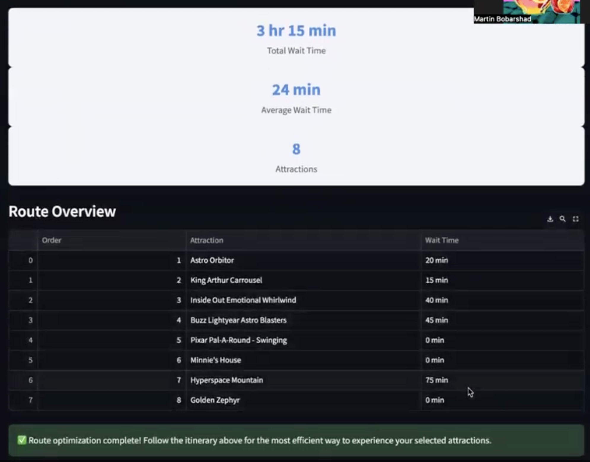

# Disney Park Planner 🏰

An interactive web app that helps visitors optimize their day at Disney parks. It continuously pulls live wait‑time data, stores it in **Amazon DynamoDB**, and generates an optimal route using **AWS Lambda**, **EventBridge**, and **Amazon Location Service**. The frontend is built with **Streamlit** and displays an intuitive map‑based UI.

---

## ✨ Key Features

| Feature                          | Tech                                             |
| -------------------------------- | ------------------------------------------------ |
| Real‑time ride data & wait times | External ride‐status API → Lambda → **DynamoDB** |
| Automated updates (every 20 min) | **EventBridge** + Lambda                         |
| Fast, serverless route optimizer | **AWS Lambda** (Python)                          |
| User‑location capture & mapping  | **Amazon Location Service** + Streamlit          |
| Responsive UI + Sidebar workflow | **Streamlit** (Python)                           |
| Secure API endpoints             | **API Gateway**                                  |
| Asset & static hosting           | **S3 Bucket**                                    |

---

## 📸 Screenshots

<table>
<tr>
<td></td>
<td></td>
<td></td>
</tr>
</table>

---

## 🏗️ Architecture (High Level)

```
┌──────────────────┐
│   Streamlit UI   │  ←— Browser
└────────┬─────────┘
         │ HTTPS (API Gateway)
┌────────▼─────────┐         ┌──────────────────┐
│  API Gateway     │ ———→    │ Amazon Location  │
└────────┬─────────┘         └──────────────────┘
         │ invokes
┌────────▼─────────┐
│ AWS Lambda       │  ←— Core logic (route calc)
└────────┬─────────┘
         │ CRUD
┌────────▼─────────┐
│ DynamoDB         │  ←— Ride data / wait times
└──────────────────┘
         ▲
         │  scheduled trigger (20 min)
┌────────┴─────────┐
│  EventBridge     │
└──────────────────┘
```

---

## 🎬 Disney Park Planner: Our Story

### What Inspired Us

Our inspiration came from the excitement and the challenges visitors face at theme parks—especially Disneyland—where long lines and scattered attractions often make planning difficult. We envisioned an app that effortlessly helps visitors maximize their time and enjoyment. Discovering how powerful and accessible AWS services are, particularly for real‑time data manipulation and backend management, motivated us to explore these technologies deeply.

### What We Learned

During this hackathon we significantly expanded our AWS skill‑set:

* **Elastic Beanstalk** for hassle‑free deployment.
* **DynamoDB** to store ride info and wait times in real time.
* **Lambda** to continuously update the database via external API calls.
* **EventBridge** to orchestrate event‑driven workflows.
* **API Gateway** to expose secure endpoints for the frontend.
* **Amazon Location Service** to capture user positions and provide geospatial context.
* **IAM** to manage fine‑grained permissions across services.

### How We Built It

* **Backend**: Python (Streamlit) with Lambda functions that refresh DynamoDB every 20 minutes (configurable).
* **Data Flow**: External ride API → Lambda → DynamoDB → API Gateway → Streamlit UI.
* **Mapping**: Amazon Location Service supplies basemap tiles and geofencing; Streamlit renders an interactive map.

### Accomplishments We’re Proud Of

* **Team learning curve**: None of us had AWS experience, yet in 48 hours we deployed a multi‑service architecture.
* Successfully linked DynamoDB, Lambda, IAM, and a custom UI into a unified experience.

### Challenges We Faced

* Wiring Lambda to API Gateway securely.
* Bridging frontend and backend state in real time.
* Converting raw JSON to DynamoDB‑compatible formats on the fly.
* Adopting new libraries (Streamlit) under time pressure.

### What’s Next

* Integrate a 3D park map that pans/zooms into attractions and draws a dotted optimal route.
* Expand to additional theme parks and generate personalized itineraries.
* Leverage **Amazon Bedrock** for generative‑AI‑driven recommendations and itinerary summaries.

Our hackathon journey laid a strong foundation for continuous innovation—helping guests craft magical, efficient theme‑park experiences worldwide.

---

## 🚀 Local Development

### 1 | Clone & create a virtual environment

```bash
git clone https://github.com/your‑org/disney‑park‑planner.git
cd disney‑park‑planner
python -m venv .venv
source .venv/bin/activate  # Windows: .venv\Scripts\activate
```

### 2 | Install dependencies

```bash
pip install -r requirements.txt
```

### 3 | Run Streamlit

```bash
streamlit run Home.py
```

The app opens automatically at **[http://localhost:8501](http://localhost:8501)**.

---